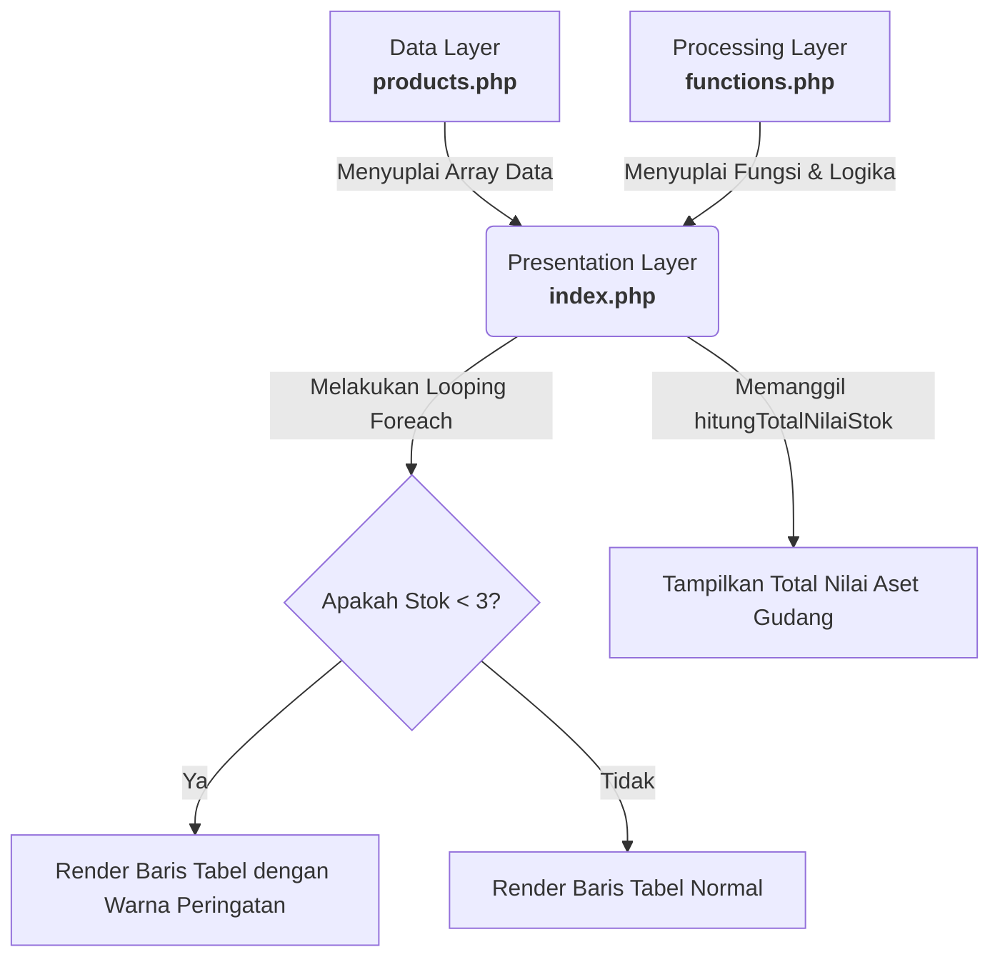

# Product Requirements Document (PRD) & Perencanaan Proyek
## Mini Project 1: Product Information System (Desain)

### 1. Pendahuluan
**Tujuan Proyek:** 
Merancang struktur blueprints sistem manajemen data informasi produk siap pakai berbasis konsep teori arsitektur berlapis (layered architecture). Fase ini difokuskan penuh pada pematangan cetak biru konsep arsitektur desain secara logis (merupakan sesi **Tanpa Coding**).

### 2. Batasan Fitur (Out of Scope / Limitations)
Untuk menjaga agar proyek tetap fokus pada tujuan pembelajaran arsitektur dasar, berikut adalah batasan-batasan fitur pada sistem ini:
*   **Tanpa Database Relasional:** Data tidak disimpan dalam database sungguhan (seperti MySQL/PostgreSQL), melainkan *hard-coded* di dalam bentuk Array PHP multidimensi.
*   **Hanya Read-Only (Tanpa CRUD):** Tidak ada antarmuka atau formulir (form) untuk menambah (Create), mengedit (Update), atau menghapus (Delete) produk. 
*   **Tanpa Interaktivitas Klien Lanjutan:** Tidak menggunakan JavaScript untuk interaksi di sisi klien (seperti *live search* atau *sorting* kolom tabel). Semua proses bisnis dan *rendering* dirender seutuhnya oleh PHP di sisi server.
*   **Hanya 3 Layer Sederhana:** Sistem diwajibkan hanya dibagi ke dalam tiga file spesifik (`products.php`, `functions.php`, `index.php`) sesuai dengan batas instruksi komponen arsitektur pada gambar.

### 3. Arsitektur Sistem (Conceptual Design)
Sistem ini menggunakan arsitektur 3-tier (Tiga Lapis) sederhana yang dipecah ke dalam 3 berkas (file) terpisah untuk menjaga *Separation of Concerns* (pemisahan tanggung jawab).

#### 3.1. Data Layer (`products.php`)
Layer ini bertindak sebagai basis data tiruan (mock database).
*   **Struktur Penyimpanan:** *Multidimensional Array* di dalam PHP.
*   **Entitas Data Produk yang Disimpan:**
    1.  `ID` (Karakter unik/angka)
    2.  `Nama` (Nama komoditas produk)
    3.  `Kategori` (Jenis/kelompok produk)
    4.  `Harga` (Harga satuan produk)
    5.  `Stok` (Jumlah ketersediaan produk)
    6.  `Deskripsi` (Penjelasan singkat mengenai produk)

#### 3.2. Processing Layer (`functions.php`)
Layer ini bertindak sebagai penampung logika bisnis (Business Logic).
*   **Kalkulasi Aset:** 
    *   Fungsi: `hitungTotalNilaiStok()`
    *   Tujuan: Menghitung total nilai aset barang yang ada di gudang.
    *   Logika Konseptual: Melakukan iterasi ke seluruh produk, lalu menjumlahkan hasil kali antara `Harga` dan `Stok` dari setiap produk (Total Aset = $\sum (Harga_i \times Stok_i)$).
*   **Filter/Indikator Visual:**
    *   Logika: Logika Kondisional (Conditional/If-Else).
    *   Syarat: `Jika (Stok < 3)`
    *   Aksi: Memberikan tanda *flagging* atau kelas khusus yang nantinya akan dibaca oleh Presentation Layer untuk merubah warna latar (background color) baris tabel tersebut menjadi warna peringatan (misalnya merah/kuning).

#### 3.3. Presentation Layer (`index.php`)
Layer ini bertindak sebagai Antarmuka Pengguna (User Interface/View).
*   **Integrasi:** Merajut komponen data dan komponen proses menggunakan perintah `require_once('products.php')` dan `require_once('functions.php')`.
*   **Rendering Layout:**
    *   Menggunakan elemen Tabel HTML (`<table>`, `<tr>`, `<td>`, `<th>`).
    *   Merender data dari array `products.php` menggunakan perulangan iterasi `foreach`.
    *   Mengeksekusi logika dari `functions.php` di dalam blok `foreach` untuk menentukan warna baris tabel.
    *   Menampilkan hasil dari `hitungTotalNilaiStok()` pada bagian bawah tabel (footer tabel) sebagai "Total Nilai Aset Gudang".

### 4. Diagram Alur Konseptual (Mental Model)

Diagram di bawah ini menunjukkan relasi antar layer (komponen) secara makro. 
Untuk melihat detail aliran eksekusi program prosedural baris-demi-baris, silakan rujuk ke dokumen terpisah: 👉 **[Processing_Flowchart.md](Processing_Flowchart.md)**

### 5. Fase Pengerjaan (Project Phases)
Sesuai arahan pembagian pengerjaan, eksekusi pembuatan sistem (coding) nantinya akan dibagi ke dalam beberapa fase terstruktur berikut:

*   **Fase 1: Pematangan Konsep & Blueprint (Sesi Saat Ini)**
    *   Membuat dokumen PRD dan menentukan arsitektur logis.
    *   Menentukan atribut data produk yang dibutuhkan dan logika bisnis.
    *   Mendefinisikan fase-fase pengerjaan agar terarah.
*   **Fase 2: Implementasi Data Layer**
    *   Pembuatan berkas `products.php`.
    *   Menulis struktur kode *multidimensional array* yang menampung sampel data komoditas produk (ID, Nama, Kategori, Harga, Stok, Deskripsi).
*   **Fase 3: Implementasi Processing Layer**
    *   Pembuatan berkas `functions.php`.
    *   Menulis fungsi `hitungTotalNilaiStok()` yang berisi logika perulangan array produk untuk mengalkulasi nilai total aset gudang.
*   **Fase 4: Implementasi Presentation Layer & Integrasi**
    *   Pembuatan berkas `index.php`.
    *   Menggunakan instruksi `require_once` untuk memuat/merajut data dari `products.php` dan `functions.php`.
    *   Membangun struktur kerangka (layout) antarmuka berupa Tabel HTML.
    *   Melakukan perulangan `foreach` untuk *merender* baris-baris data dari array ke dalam tabel HTML.
    *   Menyisipkan logika kondisional (`if stok < 3`) di dalam perulangan untuk memanipulasi *class CSS/style* warna baris tabel.
    *   Memanggil dan menampilkan nilai yang dikembalikan (*return value*) dari fungsi `hitungTotalNilaiStok()` pada footer antarmuka tabel.
*   **Fase 5: Pengujian Akhir (Testing / Validasi)**
    *   Pengujian Unit Sederhana: Mengubah angka pada variabel `Stok` di `products.php` menjadi di bawah 3 secara manual, lalu melihat apakah barisnya otomatis berganti warna.
    *   Pengujian Logika Matematika: Menghitung manual dengan kalkulator total nilai aset berdasarkan sampel data awal untuk dicocokkan dengan hasil output pada halaman `index.php`.

### 6. Kriteria Penerimaan (Acceptance Criteria)
Sebagai sebuah sesi perancangan konseptual, rancangan/dokumen blueprint ini dinyatakan sukses apabila:
- [x] Telah mendefinisikan **Batasan Fitur** dengan jelas agar cakupan proyek tidak melebar.
- [x] Telah membagi alur pengembangan ke dalam **Fase Pengerjaan** (Phases) yang rasional dan sesuai prosedur.
- [x] Telah mendefinisikan atribut multidimensional array secara lengkap.
- [x] Telah mendefinisikan aturan dan logika fungsi `hitungTotalNilaiStok()`.
- [x] Telah menetapkan syarat visual bersyarat (conditional) pewarnaan baris tabel (Stok < 3).
- [x] Telah memahami cara merajut ketiga komponen tersebut dalam satu file utama (`index.php`).

> [!NOTE] 
> Sesuai catatan instruksi pada presentasi, tahap ini hanya menghasilkan cetak biru (Blueprint). Pengeksekusian implementasi kode sesungguhnya akan dilanjutkan pada sesi koding berikutnya dengan mengikuti 5 Fase yang sudah dirancang pada Bab 5.
