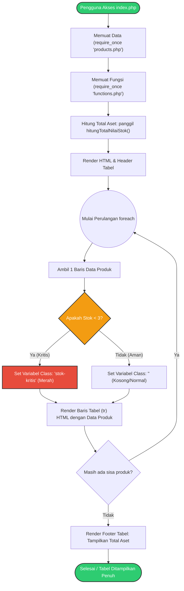

# Processing Flowchart: Sistem Informasi Manajemen Produk

Dokumen ini berisi diagram alur logika (Flowchart) yang menggambarkan bagaimana eksekusi program berjalan secara prosedural dari awal hingga selesai dirender ke layar (browser).

Diagram ini berfokus pada **Processing Layer** dan **Presentation Layer** saat memanipulasi data dari **Data Layer**.

## Diagram Alur Logika Eksekusi (Procedural Flow)
# Saya menggunakan Mermaid untuk memudahkan pembuatan 

### Penjelasan Langkah-langkah:
1. **Inisialisasi**: Saat `index.php` dibuka, hal pertama yang dilakukan adalah menarik data array dari `products.php` dan menarik fungsi matematika dari `functions.php`.
2. **Kalkulasi Awal**: Sebelum tabel digambar, fungsi `hitungTotalNilaiStok()` dijalankan terlebih dahulu untuk mendapatkan angka total aset gudang.
3. **Mulai Perulangan (Looping)**: Program memasuki blok `foreach` untuk memecah array produk satu per satu.
4. **Logika Kondisional (If-Else)**: Untuk setiap barang yang sedang diproses dalam perulangan, program mengecek nilai `Stok`. 
   - Jika di bawah 3, disiapkan penanda warna peringatan (*class CSS merah*).
   - Jika tidak, dibiarkan normal.
5. **Render HTML**: Baris tabel dicetak dengan data produk dan warna yang sesuai.
6. **Validasi Sisa Data**: Jika masih ada barang di array, kembali ke langkah 3. Jika habis, perulangan berhenti.
7. **Penyelesaian**: Mencetak angka Total Aset yang dihitung di langkah 2 ke bagian paling bawah tabel, lalu proses rendering selesai.
