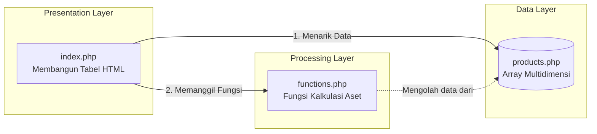

# Software Architecture Document (SAD)
## Mini Project 1: Product Information System

### 1. Pendahuluan
Dokumen ini menguraikan arsitektur perangkat lunak untuk Mini Project 1. Fokus utama dari perancangan sistem ini adalah penerapan pola desain **Layered Architecture** (Arsitektur Berlapis) untuk mencapai *Separation of Concerns* (Pemisahan Tanggung Jawab) antara data, logika, dan tampilan.

### 2. Pola Arsitektur (Architectural Pattern)
Sistem ini dibangun menggunakan arsitektur **3-Tier (3 Lapis)** yang disederhanakan menggunakan PHP prosedural murni tanpa *framework*.
*   **Data Layer:** Bertanggung jawab atas penyimpanan, penyediaan, dan penataan struktur data mentah.
*   **Processing Layer (Business Logic):** Bertanggung jawab atas kalkulasi matematis, pengkondisian, dan aturan bisnis.
*   **Presentation Layer (View):** Bertanggung jawab atas perenderan Antarmuka Pengguna (UI) dan menavigasi aliran data ke layar.

### 3. Dekomposisi Komponen (Component Breakdown)

#### 3.1. Data Component (`products.php`)
*   **Tipe:** Static Data Store (Mock Database)
*   **Deskripsi:** Menggunakan struktur data *Multidimensional Array* untuk mensimulasikan sekumpulan *record* dari sebuah tabel database.
*   **Atribut Data:** `ID`, `Nama`, `Kategori`, `Harga`, `Stok`, `Deskripsi`.

#### 3.2. Processing Component (`functions.php`)
*   **Tipe:** Logic Module
*   **Fungsi Utama:** `hitungTotalNilaiStok(array $products)`
*   **Aturan Bisnis (Business Rules):** 
    1. Melakukan kalkulasi total aset dengan rumus: `Harga x Stok`.
    2. Menyediakan logika untuk identifikasi Stok Kritis (jika Stok < 3) yang nantinya dimanfaatkan oleh *Presentation Layer* untuk visualisasi.

#### 3.3. Presentation Component (`index.php`)
*   **Tipe:** User Interface (UI)
*   **Ketergantungan (Dependencies):** Terikat dan bergantung langsung pada *Data Component* dan *Processing Component*. Komponen ini dihubungkan secara *loose* menggunakan perintah bawaan PHP `require_once`.
*   **Teknologi:** HTML5, CSS statis internal, dan perulangan PHP (`foreach`).

### 4. Diagram Komponen Arsitektur (UML Component-like)

Diagram di bawah ini menggambarkan bagaimana tiap lapisan (*layer*) berinteraksi satu sama lain dalam arsitektur ini.

### 5. Keamanan & Performa (Security & Performance)
*Karena ini adalah sistem prototipe skala kecil (Mini Project):*
*   **Performa:** Sangat ringan dan cepat karena tidak membutuhkan koneksi latensi ke server *database* eksternal. Semua eksekusi berjalan di memori lokal (RAM).
*   **Keamanan:** Data bersifat *Read-Only* secara *hardcode*, sehingga bebas dari risiko injeksi SQL (*SQL Injection*) pada tahap ini.
